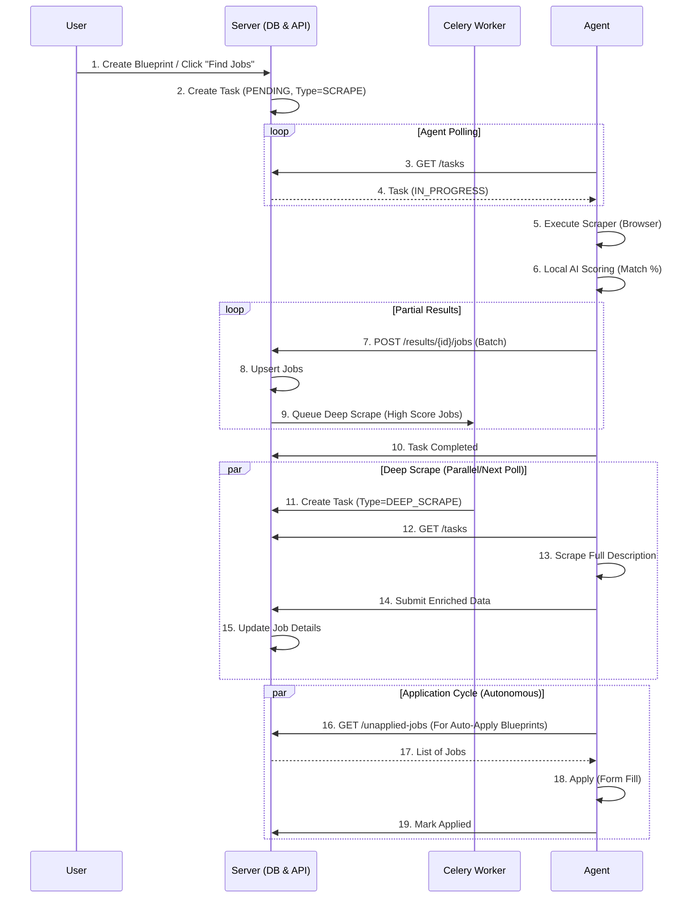

# Agent & Server Architecture: Workflow Analysis

## 1. Overview
This document details the architectural interaction between the ApplyVortex Server (FastAPI) and the Autonomous Agent (Python/Playwright) following the creation of a user Blueprint. It focuses on the lifecycle of task creation, execution, and data synchronization.

## 2. Core Concepts

### 2.1 User Blueprint (`UserBlueprint`)
The Blueprint is the configuration entity that dictates the Agent's behavior.
- **Filters**: Keywords, Location, Experience Level, Job Type, Salary.
- **Status**: Defines the automation level:
  - `IDLE` (0): No automatic actions.
  - `AUTO_SCRAPE` (1): Automatically discover jobs but do not apply.
  - `AUTO_APPLY` (2): Discover jobs and automatically queue them for application.
- **Frequency**: How often the agent should check for new jobs (e.g., every 24 hours).

### 2.2 Agent Task (`AgentForgeTask`)
A unit of work assigned to the Agent.
- **Types**:
  - `SCRAPE` (1): Discovery mode. Finds jobs listing based on criteria.
  - `AUTO_APPLY` (2): Full cycle mode. Finds jobs and implies intent to apply (triggers deep scraping).
  - `APPLY` (3): Single job application execution.
  - `PARSE` (4): Resume parsing.
- **State**: `PENDING` -> `IN_PROGRESS` -> `COMPLETED` / `FAILED`.

## 3. Workflow Lifecycle

### 3.1 Step 1: Triggering the Workflow
The workflow begins either manually (User clicks "Find Jobs") or arguably through a scheduler (future implementation for periodic checks).

**Manual Trigger Flow:**
1. **User Action**: User clicks "Find Jobs" (Discovery) or "Auto Apply" (Full Cycle) on the UI.
2. **API Call**: Client sends `POST /api/v1/scrapers/{portal}` (e.g., `/scrapers/linkedin`).
3. **Task Creation**: 
   - Server (`ScraperService`) creates a new `AgentForgeTask`.
   - **Status**: `PENDING`.
   - **Payload**: Contains Blueprint/Search criteria (Keywords, Location, Filters).

### 3.2 Step 2: Agent Polling & Task Pickup
The Agent runs an independent infinite loop (`agent_loop` in `main.py`).

1. **Poll**: Agent calls `GET /agent-forge/tasks`.
2. **Server Logic** (`agent_forge.py`):
   - Finds the oldest `PENDING` task for the user.
   - **Locks** the task row (using `with_for_update`) to prevent race conditions.
   - Updates status to `IN_PROGRESS`.
   - Returns the task details to the Agent.
3. **Execution**: Agent receives the task and routes it to the appropriate handler (`process_task`).

### 3.3 Step 3: Phase 1 - Discovery (Scraping)
If the task is `SCRAPE` or `AUTO_APPLY`:

1. **Scraper Selection**: Agent initializes `LinkedInScraper` or `NaukriScraper` based on payload.
2. **Browser Interaction**:
   - Launches Playwright (Headless or GUI).
   - Navigates to the Job Portal search URL constructed from Blueprint keywords.
   - Scrolls and extracts job cards (Title, Company, Location, URL, ID).
3. **Partial Sync & AI Scoring**:
   - As the Agent scrapes batches of jobs, it performs **Local AI Scoring** (`resume_scoring_service`).
   - It calculates a `match_score` by comparing the job summary with the user's local profile context.
   - It sends batches to Server via `POST /agent-forge/results/{task_id}/jobs`.
4. **Server Persistence** (`submit_partial_jobs`):
   - Receives enriched job data.
   - **Upsert**: Creates new `Job` records or updates existing ones in the Postgres DB.
   - **Filter Logic**: Can filter out low-match jobs (currently disabled/logging only).
   - **Deep Scrape Trigger**: If the job has a high match score Or if the task is `AUTO_APPLY`, the server **queues a Deep Scrape**.
     - Queuing works by creating a Celery task (`deep_scrape_job_task`), which in turn creates a new `AgentForgeTask` (Type: `AUTO_APPLY`, Action: `deep_scrape`).

### 3.4 Step 4: Phase 2 - Deep Scraping (Enrichment)
The Agent picks up the new "Deep Scrape" tasks generated in Step 3.

1. **Task Pickup**: Agent gets the task with `action="deep_scrape"` and `job_url`.
2. **Execution**:
   - Agent navigates directly to the specific Job Description page.
   - Extracts full details: Full Description, Responsibilities, Requirements, "Easy Apply" status.
3. **Server Sync**:
   - Agent submits result via `POST /agent-forge/results/{task_id}`.
   - **Payload**: `{ "enriched_data": { ... } }`.
4. **Data Update**: Server updates the existing `Job` record with the full description and timestamps (`deep_scraped_at`).

### 3.5 Step 5: Phase 3 - Application Cycle
This phase is handled by the Agent's autonomous loop, independent of specific "Task" assignments from the queue (though it interacts with the Server's state).

1. **Fetch Unapplied**: 
   - Agent loop calls `client.get_unapplied_jobs()` periodically.
   - Server returns jobs where:
     - `UserBlueprint.status == AUTO_APPLY` (Active Blueprint).
     - Job is not yet applied.
2. **Processing**:
   - Agent iterates through the list.
3. **Application Execution**:
   - **Resume Tailoring**: (Optional) Agent/Server generates a tailored resume PDF for the specific job description.
   - **Browser Action**: Agent navigates to application URL.
   - **Form Filling**: Uses `ApplicationHandler` to fill inputs, upload resume, and click Submit.
4. **Result Reporting**:
   - Success: Agent calls `POST /agent-forge/jobs/{job_id}/applied`.
   - Server updates `UserJobMap` status to `APPLIED`.

## 4. Work Flow Diagram (Textual)

## 5. Key Database Models

- **UserBlueprint**: Stores the user's intent and configuration.
- **AgentForgeTask**: The control mechanism. Links a User, an Agent, and a specific Action.
- **Job**: The "Project" or "Listing" discovered.
- **UserJobMap**: Connects a User to a Job, storing personal state (Match Score, Application Status, Applied Date).
- **Agent**: Represents the running instance (Hostname, Heartbeat) to ensure tasks are only given to active workers.
